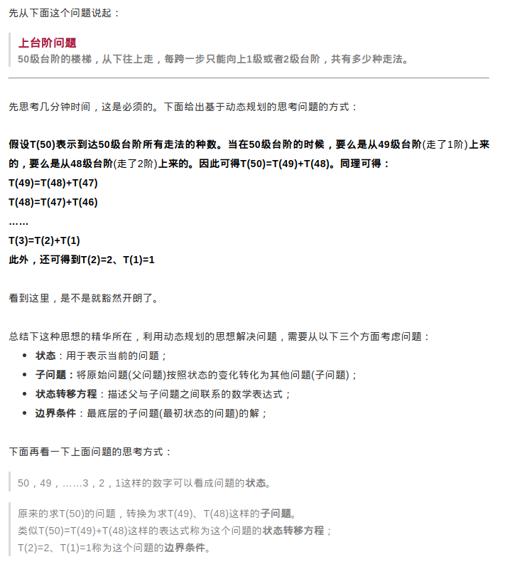

#### 動態規劃（dynamic programming）
[原文](https://mp.weixin.qq.com/s?__biz=MzUxMzg1NTI5Nw==&mid=2247484061&idx=1&sn=b663cdc708d6fa02c764bc6a13f20b8e&chksm=f94f98b3ce3811a50461a34286526a9825f2d50debc6fff876688315857af539cbf7a1b714c7&scene=21#wechat_redirect)

##### A. 動態規劃主要有以下數種經典類型
- 上台階問題
    ```
        50级台阶的楼梯，从下往上走，每跨一步只能向上1级或者2级台阶，共有多少种走法。
    ```
- 換零錢問題
    1. 基礎版
    ```
        把100元兑换成1元，2元，5元，10元，20元，50元的零钱，共有多少种不同换法。
    ```
    2. 進階版
    ```
        有面值为1元、3元和5元的钱币若干张，如何用最少的钱币凑够11元，并列出组合方法
    ```
- 背包問題
    1. 0-1背包
    ```
        有N件物品，背包的最大承重为M，每件物品的数量均为1，价值集合为V，重量集合为W，计算该背包可以承载的物品的最大价值。
    ```
    2. 多重背包
    ```
        有N件物品，背包的最大承重为M，每件物品的数量集合为C，价值集合为V，重量集合为W，计算该背包可以承载的物品的最大价值。
    ```
    3. 完全背包
    ```
        有N件物品，背包的最大承重为M，每件物品的数量无限，价值集合为V，重量集合为W，计算该背包可以承载的物品的最大价值。
    ```

---

##### B. 節錄自原文的核心思想


