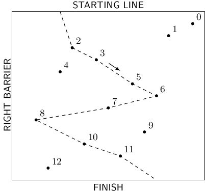

You are a skier participating in a giant slalom. The slalom track is located on a ski slope, goes downhill and is fenced by barriers on both sides. The barriers are perpendicular to the starting line located at the top of the slope. There are N slalom gates on the track. Each gate is placed at a distinct distance from the starting line and from the barrier on the right-hand side (looking downhill).

You start from any place on the starting line, ski down the track passing as many gates as possible, and finish the slalom at the bottom of the slope. Passing a gate means skiing through the position of the gate.

You can ski downhill in either of two directions: to the left or to the right. When you ski to the left, you pass gates of increasing distances from the right barrier, and when you ski to the right, you pass gates of decreasing distances from the right barrier. You want to ski to the left at the beginning.

Unfortunately, changing direction (left to right or vice versa) is exhausting, so you have decided to change direction at most two times during your ride. Because of this, you have allowed yourself to miss some of the gates on the way down the slope. You would like to know the maximum number of gates that you can pass with at most two changes of direction.

The arrangement of the gates is given as an array A consisting of N integers, whose elements specify the positions of the gates: gate K (for 0 ≤ K < N) is at a distance of K+1 from the starting line, and at a distance of A[K] from the right barrier.

For example, consider array A such that:

  A[0] = 15
  A[1] = 13
  A[2] = 5
  A[3] = 7
  A[4] = 4
  A[5] = 10
  A[6] = 12
  A[7] = 8
  A[8] = 2
  A[9] = 11
  A[10] = 6
  A[11] = 9
  A[12] = 3



The picture above illustrates the example track with N = 13 gates and a course that passes eight gates. After starting, you ski to the left (from your own perspective). You pass gates 2, 3, 5, 6 and then change direction to the right. After that you pass gates 7, 8 and then change direction to the left. Finally, you pass gates 10, 11 and finish the slalom. There is no possible way of passing more gates using at most two changes of direction.

Write a function:

func Solution(A []int) int

that, given an array A consisting of N integers, describing the positions of the gates on the track, returns the maximum number of gates that you can pass during one ski run.

For example, given the above data, the function should return 8, as explained above.

For the following array A consisting of N = 2 elements:

  A[0] = 1
  A[1] = 5
the function should return 2.

Write an efficient algorithm for the following assumptions:

N is an integer within the range [1..100,000];
each element of array A is an integer within the range [1..1,000,000,000];
the elements of A are all distinct.

##### 心得
```
主要考 Longest Increasing Subsequence（LIS）
```
##### 參考
[Code Says](https://codesays.com/2016/solution-to-slalom-skiing-by-codility/)
[LIS](http://web.ntnu.edu.tw/~algo/LongestIncreasingSubsequence.html)
